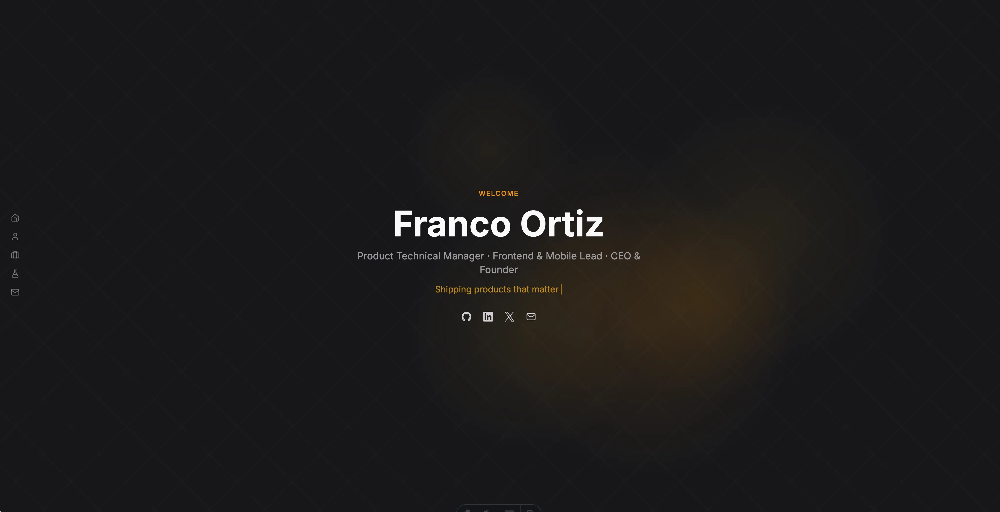

# Franco Ortiz - Portfolio



## Overview

Personal portfolio for Franco Ortiz — Technical Product Manager, Frontend & Mobile Lead, and CEO & Founder of [i1n](https://i1n.ai).

**Live:** [franco-ortiz.com](https://franco-ortiz.com/)

## Tech Stack

- **Framework:** Astro (static, zero JS by default)
- **Styling:** TailwindCSS
- **Icons:** astro-icon (Lucide + Simple Icons)
- **Font:** Inter Variable (self-hosted via @fontsource)
- **Images:** Astro Image optimization (astro:assets)
- **Deploy:** GitHub Pages via GitHub Actions
- **Package Manager:** Bun

## Project Structure

```
src/
├── layouts/Layout.astro       # Base layout, meta tags, SEO, global styles
├── pages/
│   ├── index.astro            # Main page
│   └── 404.astro              # Redirect to /
├── components/
│   ├── Sidebar.astro          # Desktop sidebar + mobile bottom bar
│   ├── MainSection.astro      # Hero with typing animation
│   ├── AboutSection.astro     # About / bio
│   ├── WorkSection.astro      # Work experience
│   ├── ProjectsSection.astro  # Highlighted + expandable projects
│   ├── ContactSection.astro   # Contact info
│   └── Footer.astro           # Footer
├── utils/                     # Static data (work, projects, about)
└── assets/                    # Images (optimized at build time)

public/
├── CNAME                      # Custom domain
├── llms.txt                   # AI crawler context
├── robots.txt                 # Crawler rules
├── sitemap.xml                # Sitemap
├── site.webmanifest           # PWA manifest
└── .well-known/security.txt   # Security contact
```

## Development

```bash
bun install
bun run dev       # Start dev server
bun run build     # Build for production
bun run preview   # Preview production build
```

## Connect

- [LinkedIn](https://www.linkedin.com/in/franco-david-ortiz/)
- [GitHub](https://github.com/Pakvothe)
- [X](https://x.com/fortiz_dev)
- [Email](mailto:fr.dv.ortiz@gmail.com)

## License

MIT License - Copyright (c) 2026 Franco Ortiz
