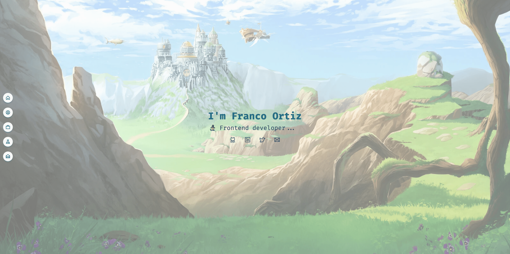

# Franco Ortiz - Portfolio



## 🚀 Overview

Welcome to my portfolio repository! I'm Franco Ortiz, a Mobile Engineering Lead specializing in frontend and mobile development. This portfolio showcases my professional journey, projects, and technical expertise.

## 🛠 Tech Stack

- **Frontend Framework:** React with TypeScript
- **Build Tool:** Vite
- **Styling:** TailwindCSS
- **Animations:** React Type Animation
- **Performance Optimization:**
  - Image optimization with vite-plugin-image-optimizer
  - Code obfuscation for production
  - Console removal in production
  - Chunk optimization
- **Development Tools:**
  - ESLint with SonarJS rules
  - Prettier
  - TypeScript strict mode

## ✨ Features

- Responsive design for all devices
- Smooth scroll navigation
- Interactive project showcase
- Contact form integration
- Performance optimized assets
- SEO friendly meta tags
- Mobile-first approach

## 📁 Project Structure

```
portfolio-v2/
├── src/
│ ├── assets/ # Images and icons
│ ├── components/ # React components
│ ├── hooks/ # Custom React hooks
│ ├── pages/ # Page components
│ ├── types/ # TypeScript definitions
│ └── utils/ # Helper functions
├── public/ # Static files
└── ...config files
```

## 🔗 Connect With Me

- [LinkedIn](https://www.linkedin.com/in/franco-david-ortiz/)
- [GitHub](https://github.com/Pakvothe)
- [Twitter](https://twitter.com/fortiz_dev)
- [Email](mailto:fr.dv.ortiz@gmail.com)

## 🌐 Live Demo

Visit my portfolio at [franco-ortiz.com](https://franco-ortiz.com/)

## 📄 License

MIT License

Copyright (c) 2024 Franco Ortiz

Permission is hereby granted, free of charge, to any person obtaining a copy
of this software and associated documentation files (the "Software"), to deal
in the Software without restriction, including without limitation the rights
to use, copy, modify, merge, publish, distribute, sublicense, and/or sell
copies of the Software, and to permit persons to whom the Software is
furnished to do so, subject to the following conditions:

The above copyright notice and this permission notice shall be included in all
copies or substantial portions of the Software.

THE SOFTWARE IS PROVIDED "AS IS", WITHOUT WARRANTY OF ANY KIND, EXPRESS OR
IMPLIED, INCLUDING BUT NOT LIMITED TO THE WARRANTIES OF MERCHANTABILITY,
FITNESS FOR A PARTICULAR PURPOSE AND NONINFRINGEMENT. IN NO EVENT SHALL THE
AUTHORS OR COPYRIGHT HOLDERS BE LIABLE FOR ANY CLAIM, DAMAGES OR OTHER
LIABILITY, WHETHER IN AN ACTION OF CONTRACT, TORT OR OTHERWISE, ARISING FROM,
OUT OF OR IN CONNECTION WITH THE SOFTWARE OR THE USE OR OTHER DEALINGS IN THE
SOFTWARE.

---

Built with 💻 by Franco Ortiz
